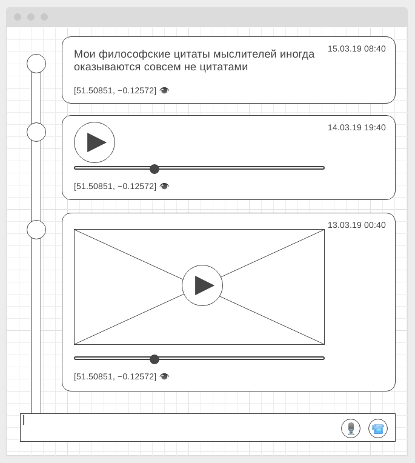

#### Deployment: <a href="https://finchik.github.io/ahj-10-media/">Github Pages</a>

---

### Общая легенда

Вам предстоит создать проект "Timeline" - некую ленту постов человека, где он может прикреплять текстовые посты, а также записывать аудио и видео в привязке к своей геопозиции.

Затем посты с текстом можно просматривать, посты с аудио - прослушивать, посты с видео - "проигрывать".

Как это примерно должно выглядеть:

